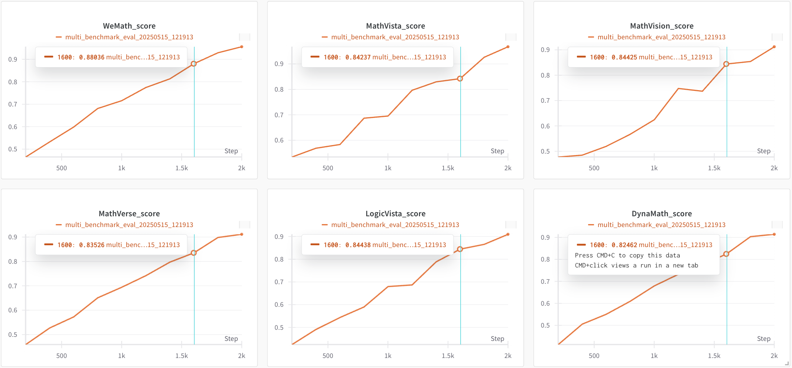

# 🚀 EvalLightning

A lightweight model evaluation framework for quickly assessing and comparing different models on the same dataset.

## 🧪 Demo Results

A demo evaluation was run using the script `scripts/examples/eval_with_wandb.sh` which executed the `examples/eval_with_wandb.py` example. The results are available in the Wandb dashboard:

[View Demo Results](https://wandb.ai/linlincode/eval-lightning-demo/runs/080qva9l?nw=nwuserlinlincode)



The demo compared models at different training steps (100, 500, 1000, 2000) showing progressive improvement in model quality from 0.3 to 0.8.

## ✨ Features

- **Lightweight Design**: Simple, intuitive API with minimal class hierarchy
- **Flexibility**: Supports any callable model function and custom datasets
- **Custom Aggregation**: Multiple score aggregation methods available
- **Parallel Evaluation**: Built-in parallel processing capabilities
- **Detailed Reports**: Comprehensive evaluation results and performance metrics
- **Wandb Integration**: Track model evaluation results with Weights & Biases

## 📦 Installation

```bash
# Install from source
git clone https://github.com/yourusername/eval-lightning.git
cd eval-lightning
pip install -e .

# Or directly via pip
# pip install eval-lightning
```

## 🚀 Quick Start

```python
from eval_lightning import EvalLightning

# Define model function
def my_model(sample):
    # Implement evaluation logic
    return score  # Return score between 0-1

# Prepare dataset
dataset = [
    {"text": "sample 1"},
    {"text": "sample 2"},
    # ...
]

# Initialize evaluator
evaluator = EvalLightning(
    models=[my_model],
    dataset=dataset
)

# Run evaluation
results = evaluator.evaluate()
```

## 📊 Aggregation Methods

```python
from eval_lightning import EvalLightning
from eval_lightning.utils import median_aggregate, weighted_aggregate

# Use built-in median aggregation
evaluator = EvalLightning(
    models=[model_a, model_b],
    dataset=dataset,
    aggregate_fn=median_aggregate
)

# Or custom aggregation function
def my_aggregate(scores):
    return final_score  # Implement custom logic

evaluator = EvalLightning(
    models=[model_a, model_b],
    dataset=dataset,
    aggregate_fn=my_aggregate
)
```

## ⚡ Parallel Evaluation

```python
# Run evaluation in parallel to speed up processing
results = evaluator.evaluate_parallel(max_workers=4)
```

## 📈 Wandb Integration

```python
# Track evaluation results with Wandb
evaluator = EvalLightning(
    models=[model_a, model_b],
    dataset=dataset,
    use_wandb=True,
    wandb_project="my-evaluation-project",
    wandb_run_name="experiment-001"  # Optional: set run name
)

results = evaluator.evaluate()
```

## 📚 Examples

Check the `examples` directory for more examples:

1. **Basic Usage**: `examples/basic_example.py`
2. **Custom Aggregation**: `examples/custom_aggregation.py`
3. **LLM Evaluation**: `examples/llm_evaluation.py`
4. **Wandb Tracking**: `examples/eval_with_wandb.py`

Run examples:

```bash
# Run a specific example
python examples/basic_example.py

# Run Wandb integration example
bash scripts/examples/eval_with_wandb.sh
```

## 📄 License

MIT
